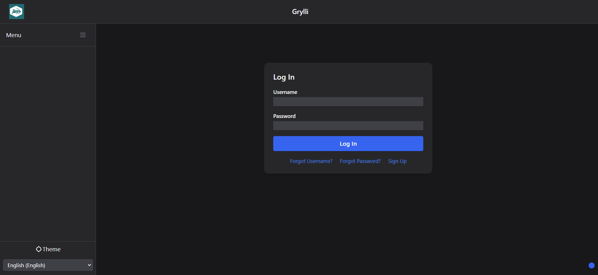
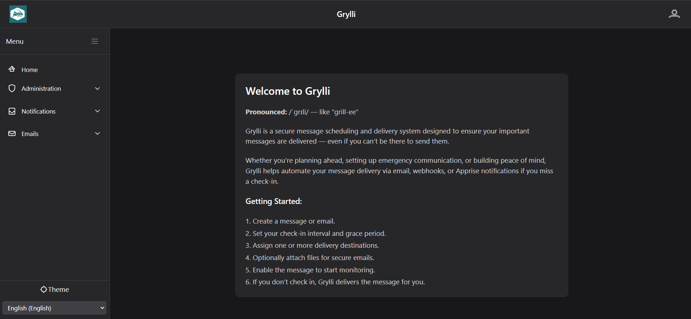
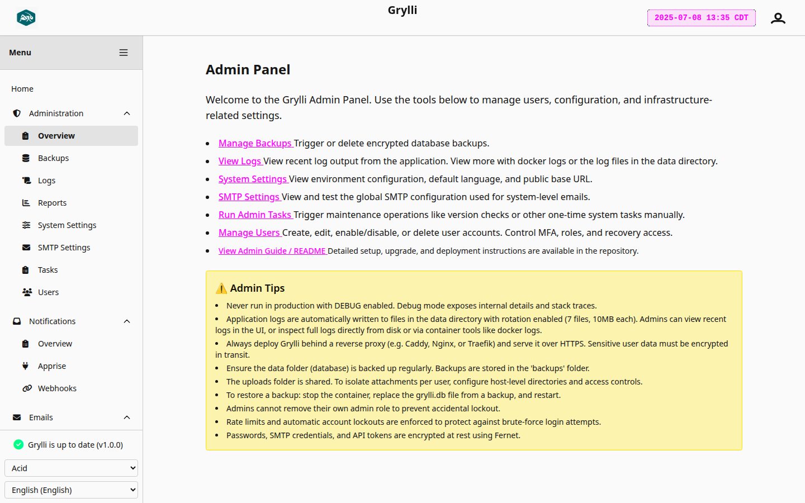
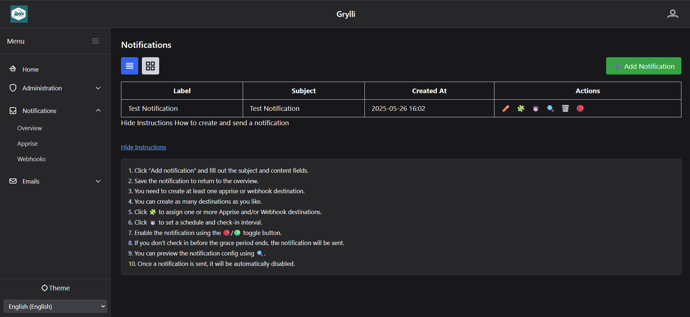
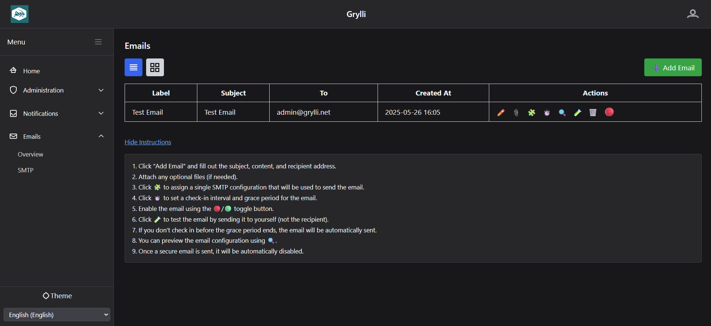
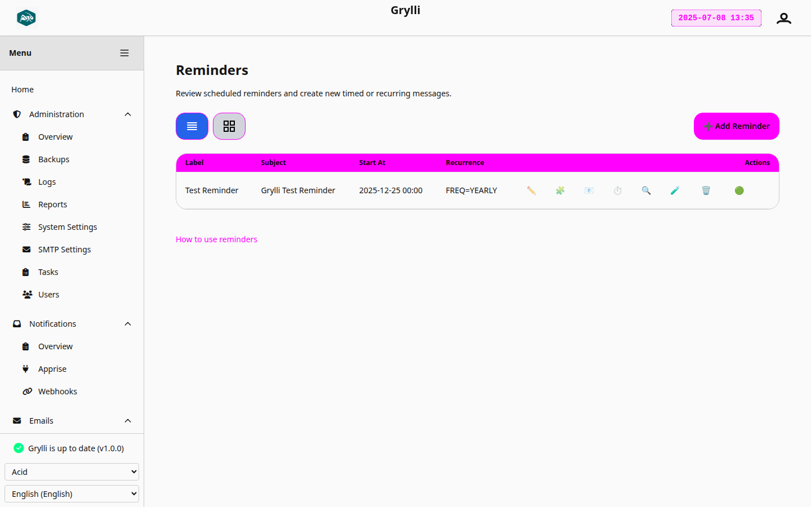

<p align="center">
  
</p>

# Grylli

Grylli is a secure, self-hosted message delivery platform that automatically sends pre-configured notifications if a user fails to check in within a defined time period.

---
[](https://github.com/samcro1967/grylli/pkgs/container/grylli)
[](https://github.com/samcro1967/grylli/releases)
[](LICENSE)

## Features

### 🚀 Core Application
- Self-hosted Flask web application with user authentication
- Responsive UI built with Tailwind CSS
- Frontend interactivity powered by Stimulus.js for minimal, CSP-compliant JavaScript
- Light and dark mode support
- Local timezone support
- Multilingual interface
- Automatic translation support using GPT-PO Translator for rapid language expansion
- Status endpoint for healthcheck and version
- Integrated version check with GitHub release comparison with automated scheduler updates
- Language selection toggle with per-user preference and locale-aware interface
- Fixed sidebar and header layout with scrollable main content for consistent UX
- Extensive internal logging for traceable execution and graceful failure handling
- Detects and applies browser language on first visit before user login
- Context-sensitive help panels for each major module
- Shared UI components and actions for consistent interactions across modules
- Progressive Web App (PWA) support with installable manifest, service worker registration, offline metadata caching, and home screen integration on mobile and desktop


### ♿ Accessibility & Inclusive Design
- Grylli has undergone a thorough accessibility audit using [pa11y](https://pa11y.org/) and manual contrast verification.
- Main pages (login, signup, dashboard, reminders, emails, messages, settings) have been remediated for WCAG 2.1 AA compliance
- All forms include semantic labels, ARIA feedback, and keyboard-accessible controls
- High-contrast themes and visible focus styles are built-in
- No inline JavaScript or event handlers (CSP-compliant)
- No CAPTCHAs or visual-only barriers; public routes are rate-limited instead
- ⚠️ Minor, non-blocking color contrast issues (e.g. emoji/icons) are acknowledged

### 🌟 Lighthouse Audit Results
Grylli has been tested with [Google Lighthouse](https://developer.chrome.com/docs/lighthouse/overview/) across all major modules, achieving:

| Metric         | Average Score |
|----------------|----------------|
| Performance    | 96             |
| Accessibility  | 99             |
| Best Practices | 93             |
| SEO            | 100            |

All primary user-facing and administrative pages meet or exceed Lighthouse guidelines.  
Installability and offline support were validated using Lighthouse PWA audits.

> ✅ Minor performance warnings on public login and signup pages are acknowledged (e.g. layout shift, unauthenticated CSS/JS) and do not affect core UX.

### 🔔 Notifications & Messaging
- Configurable notification and check-in system
- Send notifications via apprise [Apprise](https://github.com/caronc/apprise) destinations
- Execute webhooks when notification grace period for checkin has expired
- Customizable emails with optional attachments
- Attach multiple files to emails
- Files are loaded from disk at send time (edit outside Grylli)

### ⏰ Reminder System
- Create reminders with labels, subjects, and rich scheduling options
- Assign email, webhook, and Apprise destinations to each reminder
- Optional test-send for validation of all linked services
- Schedule single or recurring reminders (daily, weekly, monthly, etc.)
- Toggle reminders on/off dynamically from the UI

### 👤 User Management & Access Control
- Multi-admin and multi-user support
- Role-based access control (RBAC) with user/admin privileges
- MFA using TOTP apps (e.g. Google Authenticator) with recovery codes
- MFA reset and recovery options for both users and admins
- Admin protection from self-demotion and critical privilege changes
- Sign-up with registration code
- Forgot username and password recovery flows
- User actions to export their data and delete their account

### 🛡️ Security & Production Readiness
- Sensitive credentials (e.g., SMTP passwords, Apprise tokens) are encrypted at rest using Fernet symmetric encryption
- Fully Content Security Policy (CSP) compliant: dynamic nonces, no inline scripts or handlers, no `.innerHTML`
- Frontend entirely refactored to use Stimulus.js controllers instead of Alpine.js or inline JavaScript
- Password and token reveal functionality is CSP-safe with strict event handling
- Admin routes are tightly permission-controlled with automatic role enforcement
- All public forms and inputs validated server-side using secure WTForms
- App-level logging captures all sensitive operations, errors, and admin events without exposing secrets
- Enforces complex passwords
- Runs as non-root using PUID/PGID
- Reverse proxy ready (`base_url` support)
- Runs in a minimal [distroless](https://github.com/GoogleContainerTools/distroless) container for production, reducing attack surface and image size
- Python sources are precompiled to `.pyc` files for faster startup and to reduce accidental code exposure in the image
- Rate limiting on failed logins and sign up
- Additional HTTP security headers: X-Content-Type-Options: nosniff, X-Frame-Options: DENY, frame-ancestors: 'none' to mitigate common web vulnerabilities
- Account lockout enforced after repeated failed login attempts, with automatic unlock after a delay
- Modular view architecture using partials for cleaner maintenance and CSP compliance
- CAPTCHA-free signup flow with soft rate limiting for better UX and accessibility

### 🛡️ Application Trust Model
- Grylli is designed with privacy and control in mind.
- Users retain full control over their check-in schedules, messages, and delivery methods.
- All sensitive user data — including email passwords, Apprise tokens, and webhook URLs — is encrypted before being stored.
- Administrators cannot view stored credentials or plaintext tokens.
- No external telemetry, analytics, or phone-home behavior is present.
- Users can export or delete their data at any time.

## ✅ Security Checklist
- [x] Passwords and secrets encrypted at rest
- [x] CSP-compliant templates and JavaScript (no inline scripts or handlers)
- [x] Rate-limited login, signup, and reset flows
- [x] MFA with TOTP and recovery support
- [x] Role-based route protections (admin vs. user)
- [x] Admin safeguards (no self-demotion)
- [x] Secure form validation with CSRF and ARIA feedback
- [x] Optional backup and deletion workflows
- [x] Automatic account lockout after repeated failed logins

### 📧 Email & Integrations
- Global SMTP settings for system-level notifications
- User-specific SMTP settings for personalized delivery

### 💾 Backups & Maintenance
- Automated daily database backups (7-day retention)
- On-demand backup option

---

## Screenshots
<details>
  <summary><strong>Show Screenshots</strong></summary>






</details>

---
## Docker Compose Configuration
[`docker-compose.sample.yml`](./docker-compose.sample.yml)

If you prefer not to use Docker Compose, you can run Grylli with a single command:

<details>
  <summary><strong>Show Docker Run Command</strong></summary>
  
```
docker run -d \
  --name grylli \
  -p 5069:5069 \
  -v $(pwd)/grylli/data:/data \
  -v $(pwd)/grylli/uploads:/uploads \
  -e TZ=America/Chicago \
  -e PUID=1000 \
  -e PGID=1000 \
  -e GRYLLI_DATA_DIR=/data \
  -e DEBUG=False \
  -e FQDN=http://your.domain.com:5069 \
  -e BASE_URL=/grylli \
  -e FLASK_APP_PORT=5069 \
  -e FLASK_APP_KEY=changeme-supersecret-key \
  -e FERRET_KEY=changeme-fernet-key \
  -e SIGNUP_CODE=YourSuperSecretCode123! \
  -e DEFAULT_LANGUAGE=en \
  -e SMTP_HOST=smtp.example.com \
  -e SMTP_PORT=587 \
  -e SMTP_USE_TLS=1 \
  -e EMAIL_FROM=you@example.com \
  -e SMTP_USER=you@example.com \
  -e SMTP_PASS=your_password_or_app_token \
  --restart unless-stopped \
  ghcr.io/samcro1967/grylli
```
</details>

### Environment Variables

<details>
  <summary><strong>Show Environment Variables</strong></summary>

| Variable           | Description                                                        | Example/Notes                             |
|--------------------|--------------------------------------------------------------------|-------------------------------------------|
| `TZ`               | Timezone for the container                                         | `America/Chicago`                         |
| `PUID`             | User ID for container process (for volume permissions)             | `1000`                                    |
| `PGID`             | Group ID for container process                                     | `1000`                                    |
| `GRYLLI_DATA_DIR`  | Directory for persistent data inside the container                 | `/data`                                   |
| `DEBUG`            | Enable or disable debug mode                                       | `False` (use `True` for debugging)        |
| `FQDN`             | Public base URL of your Grylli instance                            | `http://your.domain.com:5069`             |
| `BASE_URL`         | Base URL path for Grylli (use `/grylli` or `/`)                    | `/grylli`                                 |
| `FLASK_APP_PORT`   | Port Grylli listens on inside the container                        | `5069`                                    |
| `FLASK_APP_KEY`    | Secret key for Flask session security                              | *(generate a secure random string)*       |
| `FERRET_KEY`       | Encryption key for sensitive data (Fernet, 32-byte base64 string)  | *(generate with Fernet)*                  |
| `SIGNUP_CODE`      | Registration code required for new sign-ups                        | `YourSuperSecretCode123!`                 |
| `DEFAULT_LANGUAGE` | Default language code                                              | `en`                                      |
| `SMTP_HOST`        | SMTP server hostname                                               | `smtp.example.com`                        |
| `SMTP_PORT`        | SMTP server port                                                   | `587` (for TLS), `465` (for SSL)          |
| `SMTP_USE_TLS`     | Use TLS for SMTP connection (1 for yes, 0 for no)                  | `1`                                       |
| `EMAIL_FROM`       | Default sender email address                                       | `you@example.com`                         |
| `SMTP_USER`        | SMTP authentication username                                       | `you@example.com`                         |
| `SMTP_PASS`        | SMTP authentication password or app token                          | `your_password_or_app_token`              |
</details>

> **Note:** See [`docker-compose.sample.yml`](./docker-compose.sample.yml) for instructions on how to generate your own `FLASK_APP_KEY` and `FERRET_KEY`.

## Credits & Key Dependencies

- [Flask](https://flask.palletsprojects.com/) — Python web framework
- [Flask-WTF](https://flask-wtf.readthedocs.io/) — Secure web forms with CSRF protection
- [Flask-Login](https://flask-login.readthedocs.io/) — User session and authentication management
- [Flask-Migrate](https://flask-migrate.readthedocs.io/) — Database migrations powered by Alembic
- [Flask-Babel](https://pythonhosted.org/Flask-Babel/) — Internationalization (i18n) and localization
- [email-validator](https://email-validator.readthedocs.io/) — Email address validation
- [cryptography](https://cryptography.io/) — Secure encryption for sensitive data
- [APScheduler](https://apscheduler.readthedocs.io/) — Advanced Python scheduling
- [Apprise](https://github.com/caronc/apprise) — Push notification and alert library
- [GPT-PO Translator](https://github.com/gaborvecsei/gpt-po-translator) — Automated PO file translation with GPT
- [gunicorn](https://gunicorn.org/) — Production Python WSGI server

Special thanks to these libraries and their authors for making Grylli possible!

---

## Recommended Third-Party Services

- [webhook (adnanh/webhook)](https://github.com/adnanh/webhook) — Simple webhook server

