<p align="center">
  
</p>

# Grylli

Grylli is a secure, self-hosted message delivery platform that automatically sends pre-configured notifications if a user fails to check in within a defined time period.

---
[](https://github.com/samcro1967/grylli/pkgs/container/grylli)
[](https://github.com/samcro1967/grylli/releases)
[](LICENSE)

<a name="toc"></a>
## Table of Contents
- [Features](#features)
  - [Core Application](#core-application)
  - [Accessibility & Inclusive Design](#accessibility-inclusive-design)
  - [Notifications](#notifications)
  - [Reminder System](#reminder-system)
  - [User Management & Access Control](#user-management-access-control)
  - [Email & Integrations](#email-integrations)
  - [Logging & Diagnostics](#logging-diagnostics)
  - [Admin Tasks](#admin-tasks)
  - [Admin Reports](#admin-reports)
  - [Security & Production Readiness](#security-production-readiness)
  - [Application Trust Model](#application-trust-model)
- [Security Checklist](#security-checklist)
- [Lighthouse Audit Results](#lighthouse-audit-results)
- [Testing & Quality Assurance](#testing-quality-assurance)
- [Backups & Maintenance](#backups-maintenance)
- [Screenshots](#screenshots)
- [Docker Compose Configuration](#docker-compose-configuration)
  - [Environment Variables](#environment-variables)
- [Credits & Key Dependencies](#credits-key-dependencies)
- [Recommended Third-Party Services](#recommended-third-party-services)

---

## Features

### Core Application
- Self-hosted Flask web application with user authentication
- Responsive UI built with Tailwind CSS
- Frontend interactivity powered by Stimulus.js for minimal, CSP-compliant JavaScript
- Light and dark mode support with **DaisyUI** components integrated for consistent theme application
- Local timezone support
- Multilingual interface with automatic translation via GPT-PO Translator
- Status endpoint for healthcheck and version
- Integrated version check with GitHub release comparison and automated scheduler updates
- Language selection toggle with per-user preference and locale-aware interface
- Fixed sidebar and header layout with scrollable main content for consistent UX
- Table/Card view preference is saved per module via localStorage for persistent view selection (e.g., Messages, Emails, Reminders, & Users)
- Modular partial layout: all list views (emails, messages, reminders, Apprise, webhooks) use shared `table_view.html`, `card_view.html`, `actions.html`, and `help_panel.html` partials for maintainability
- Context-sensitive help panels for each major module
- Dashboard with equal-height cards showing reminders, emails, messages, Apprise, webhooks, and SMTP at a glance
- Dedicated **Schedule** tab showing all enabled items and their configured run times
- **Activity** tab displaying filtered logs of recent user actions and system events
- Shared UI components and actions ensure consistency across table and card views
- Progressive Web App (PWA) support: installable manifest, service worker registration, offline metadata caching, and mobile/desktop home screen integration.  Requires HTTPS and a public certificate.
- Seamless navigation and interaction using **HTMX**:
  - All sidebar and profile dropdown links use HTMX for dynamic content loading
  - Add/edit/delete/cancel actions update only affected content via HTMX
  - Buttons for test/send/enable/disable are handled dynamically via HTMX and fully CSP-compliant

---

### Accessibility & Inclusive Design
[⬆ Back to Table of Contents](#toc)
- Grylli has undergone a thorough accessibility audit using [pa11y](https://pa11y.org/) and manual contrast verification.
- Main pages (login, signup, dashboard, reminders, emails, messages, settings) have been remediated for WCAG 2.1 AA compliance
- All forms include semantic labels, ARIA feedback, and keyboard-accessible controls
- High-contrast themes and visible focus styles are built-in
- No inline JavaScript or event handlers (CSP-compliant)
- No CAPTCHAs or visual-only barriers; public routes are rate-limited instead
- ⚠️ Minor, non-blocking color contrast issues (e.g. emoji/icons) are acknowledged

---

### Messages
[⬆ Back to Table of Contents](#toc)
- Configurable notification and check-in system
- Deliver Messages using [Apprise](https://github.com/caronc/apprise), with support for dozens of services
- Execute webhooks when notification grace period for checkin has expired
- Customizable emails with optional attachments
- Attach multiple files to emails
- Files are loaded from /uploads at send time (edit outside Grylli)

---

### Reminder System
[⬆ Back to Table of Contents](#toc)
- Create reminders with labels, subjects, and rich scheduling options
- Assign email, webhook, and Apprise destinations to each reminder
- Optional test-send for validation of all linked services
- Schedule single or recurring reminders (daily, weekly, monthly, etc.)
- Toggle reminders on/off dynamically from the UI

---

### User Management & Access Control
[⬆ Back to Table of Contents](#toc)
- Multi-admin and multi-user support
- Role-based access control (RBAC) with user/admin privileges
- MFA using TOTP apps (e.g. Google Authenticator) with recovery codes
- MFA reset and recovery options for both users and admins
- Admin protection from self-demotion and critical privilege changes
- Sign-up with registration code
- Forgot username and password recovery flows
- User actions to export their data and delete their account

---

### Email & Integrations
[⬆ Back to Table of Contents](#toc)
- Global SMTP settings for system-level notifications
- User-specific SMTP settings for personalized delivery

---

### Logging & Diagnostics
[⬆ Back to Table of Contents](#toc)
- All application events are logged with context, including:
  - check-in attempts, enable/disable actions, task execution, test runs, and validation errors
  - internal exceptions are captured with full tracebacks and categorized by severity
- Logs are written to both stdout and `data/grylli.log` by default
- Admin panel includes a **filterable and sortable log viewer**:
  - Filter by log level, text content, and timestamp (before/after)
  - Sort by timestamp or severity column
  - HTMX-powered for live interaction without full page reload
- Dedicated **Activity** tab shows recent user-facing log events tied to current user
- CSP violation reports are captured, parsed, and logged for debugging front-end policy violations
- Debug layout view captures DOM structure, controller bindings, loaded styles/scripts, and page metadata
- All logging is structured for human readability and system integration
- Debug-friendly logging helpers (`log_info_message`, `log_exception_with_traceback`) used across all routes for consistent traceability

---

### Admin Tasks
[⬆ Back to Table of Contents](#toc)
- Admin-only UI available under **Tasks** for executing one-time system actions
- First task available: **Manual Version Check**
  - Triggers the same logic used in the scheduled update check
  - Confirms if a new Grylli release is available on GitHub
- Fully CSP-compliant task execution and feedback via flash messages

---

### Admin Reports
[⬆ Back to Table of Contents](#toc)
- Admin-only dashboard with real-time reports and usage summaries
- Tabbed UI with HTMX-based dynamic content loading (no full page reloads)
- Currently available reports:
  - **Accounts**: Overview of all users, roles, MFA status, activity flags, and lockouts
  - **Scheduler Activity**: Displays execution history for scheduled items (reminders, emails, messages)
- Uses modular partial templates and consistent DaisyUI styling
- Reports are automatically updated with the latest activity and user status changes
- Table views support sortable and accessible column headers

---

### Security & Production Readiness
[⬆ Back to Table of Contents](#toc)
- Sensitive credentials (e.g., SMTP passwords, Apprise tokens) are encrypted at rest using Fernet symmetric encryption
- Fully Content Security Policy (CSP) compliant: dynamic nonces, no inline scripts or handlers, no `.innerHTML`
- Frontend entirely refactored to use Stimulus.js controllers instead of Alpine.js or inline JavaScript
- Password and token reveal functionality is CSP-safe with strict event handling
- Admin routes are tightly permission-controlled with automatic role enforcement
- All public forms and inputs validated server-side using secure WTForms
- App-level logging captures all sensitive operations, errors, and admin events without exposing secrets
- Enforces complex passwords
- Runs as non-root using PUID/PGID
- Reverse proxy ready (`base_url` support)
- Runs in a minimal [distroless](https://github.com/GoogleContainerTools/distroless) container for production, reducing attack surface and image size
- Python sources are precompiled to `.pyc` files for faster startup and to reduce accidental code exposure in the image
- Rate limiting on failed logins and sign up
- Additional HTTP security headers: X-Content-Type-Options: nosniff, X-Frame-Options: DENY, frame-ancestors: 'none' to mitigate common web vulnerabilities
- Account lockout enforced after repeated failed login attempts, with automatic unlock after a delay
- Modular view architecture using partials for cleaner maintenance and CSP compliance
- CAPTCHA-free signup flow with soft rate limiting for better UX and accessibility

---

### File Integrity Verification
[⬆ Back to Table of Contents](#toc)
- Grylli performs a secure file integrity check on startup to ensure application files have not been tampered with.
- A `file_hashes.sha256` manifest is generated at build time, containing **SHA-256 hashes** for all `.py`, `.html`, and `.js` files in the source tree.
- At runtime, a built-in Python script verifies these hashes against the actual files on disk.
- If any file has been modified or added, **startup is aborted**, and the failure is logged.
- This ensures administrators or malicious actors cannot modify core logic or templates without detection.
- A scheduler task re-validates file integrity and exits if any tampering is detected.

---

### Application Trust Model
[⬆ Back to Table of Contents](#toc)
- Grylli is designed with privacy and control in mind.
- Users retain full control over their check-in schedules, messages, and delivery methods.
- All sensitive user data — including email passwords, Apprise tokens, and webhook URLs — is encrypted before being stored.
- Administrators cannot view stored credentials or plaintext tokens.
- No external telemetry, analytics, or phone-home behavior is present.
- Users can export or delete their data at any time

---

## Security Checklist
[⬆ Back to Table of Contents](#toc)
- [x] Passwords and secrets encrypted at rest
- [x] CSP-compliant templates and JavaScript (no inline scripts or handlers)
- [x] Rate-limited login, signup, and reset flows
- [x] MFA with TOTP and recovery support
- [x] Role-based route protections (admin vs. user)
- [x] Admin safeguards (no self-demotion)
- [x] Secure form validation with CSRF and ARIA feedback
- [x] Optional backup and deletion workflows
- [x] Automatic account lockout after repeated failed logins
- [x] CSP Violation Reporting: Server now captures and logs CSP violations

---

### Lighthouse Audit Results
[⬆ Back to Table of Contents](#toc)
Grylli has been tested with [Google Lighthouse](https://developer.chrome.com/docs/lighthouse/overview/) across all major modules, achieving:

| Metric         | Average Score |
|----------------|----------------|
| Performance    | 96             |
| Accessibility  | 99             |
| Best Practices | 93             |
| SEO            | 100            |

All primary user-facing and administrative pages meet or exceed Lighthouse guidelines.  
Installability was validated using Lighthouse PWA audits.

---

## **Testing & Quality Assurance**
[⬆ Back to Table of Contents](#toc)
Grylli has a comprehensive test suite covering the platform's core features, ensuring the stability, security, and functionality of all workflows.

### **Test Coverage Breakdown**
[⬆ Back to Table of Contents](#toc)
| Module                     | Coverage |
|----------------------------|----------|
| **Auth Routes**            | 83%      |
| **Admin Panels**           | 84%      |
| **Reminder Logic**         | 78%      |
| **Email Workflows**        | 82%      |
| **Apprise & Webhooks**     | 78%      |
| **Backup & Restore**       | 85%      |
| **MFA Setup & Reset**      | 84%      |
| **Account Management**     | 68%      |
| **CSP Compliance**         | 100%     |
| **Public Pages**           | 100%     |
| **Version Metadata**       | 100%     |
| **Route Permissions**      | 100%     |

**Total Coverage**: **81%**  
(4977 statements, 933 currently not covered)

### **Test Framework**
[⬆ Back to Table of Contents](#toc)
- Written using **pytest**
- Uses **SQLAlchemy 2.x-style** `db.session.get()` methods
- Mocks all external calls (email, encryption, login state) for safe, fast test runs
- Enforces role-based access control through simulated admin/user scenarios
- Coverage includes flash messages, status codes, and failure paths

---

## Backups & Maintenance
[⬆ Back to Table of Contents](#toc)
- Automated daily database backups (7-day retention)
- On-demand backup option

---

## Screenshots
[⬆ Back to Table of Contents](#toc)
<details>
  <summary><strong>Show Screenshots</strong></summary>

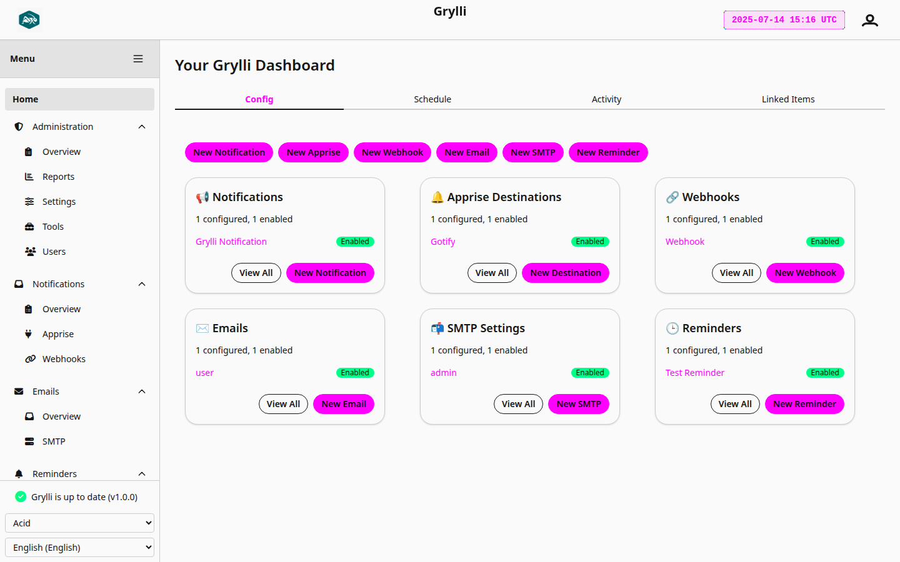
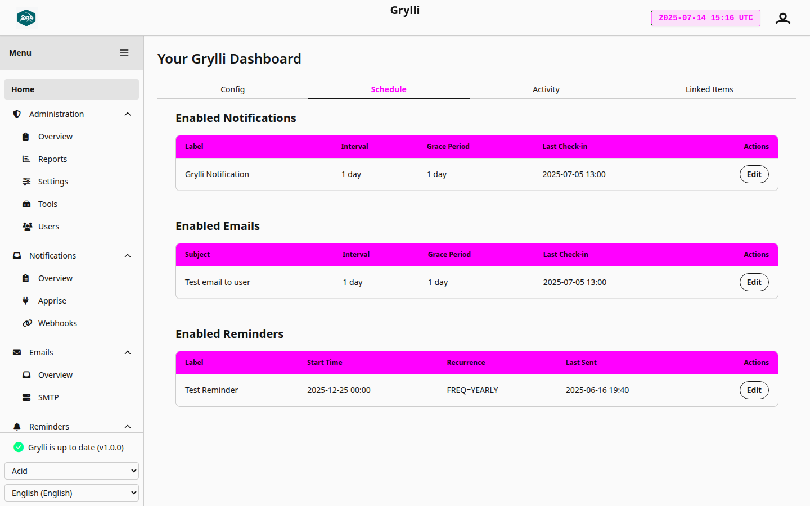
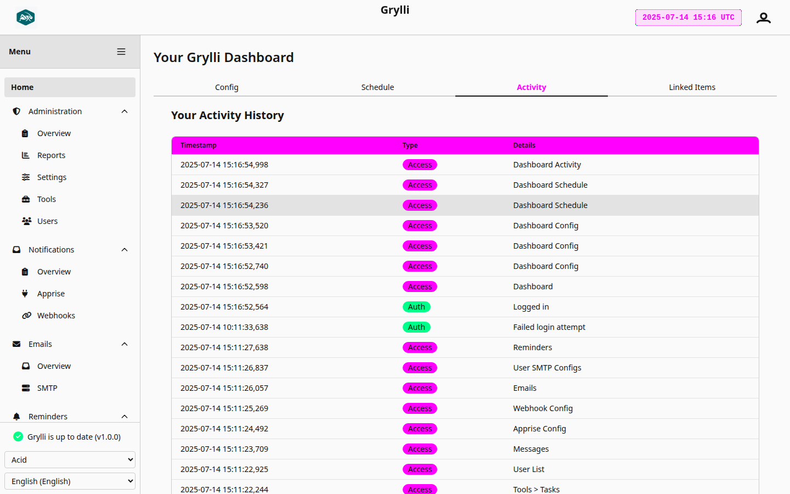

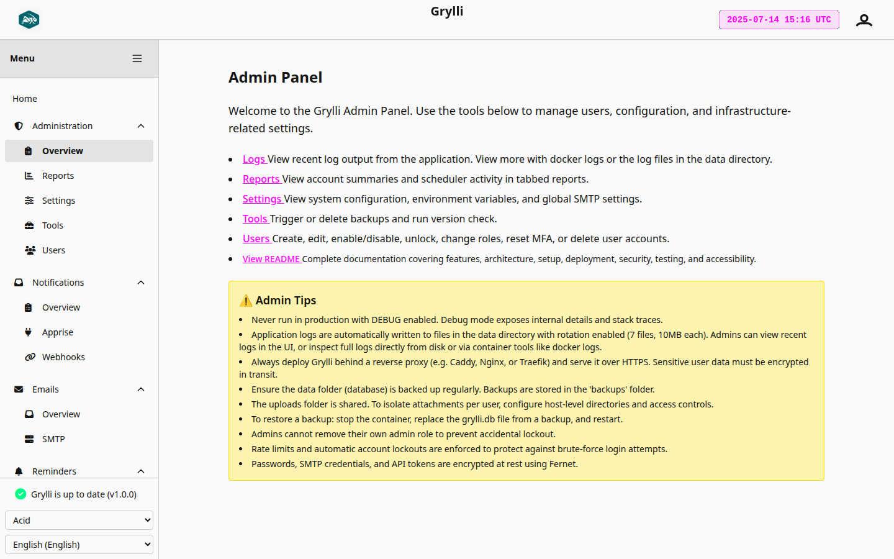
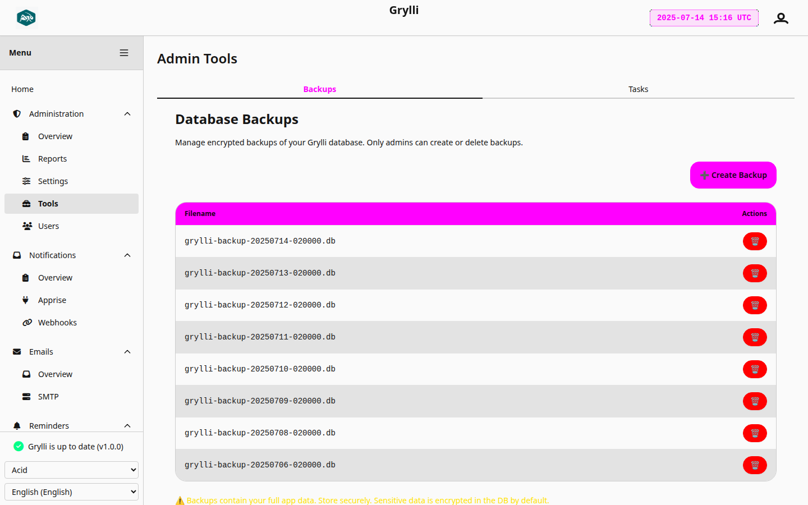
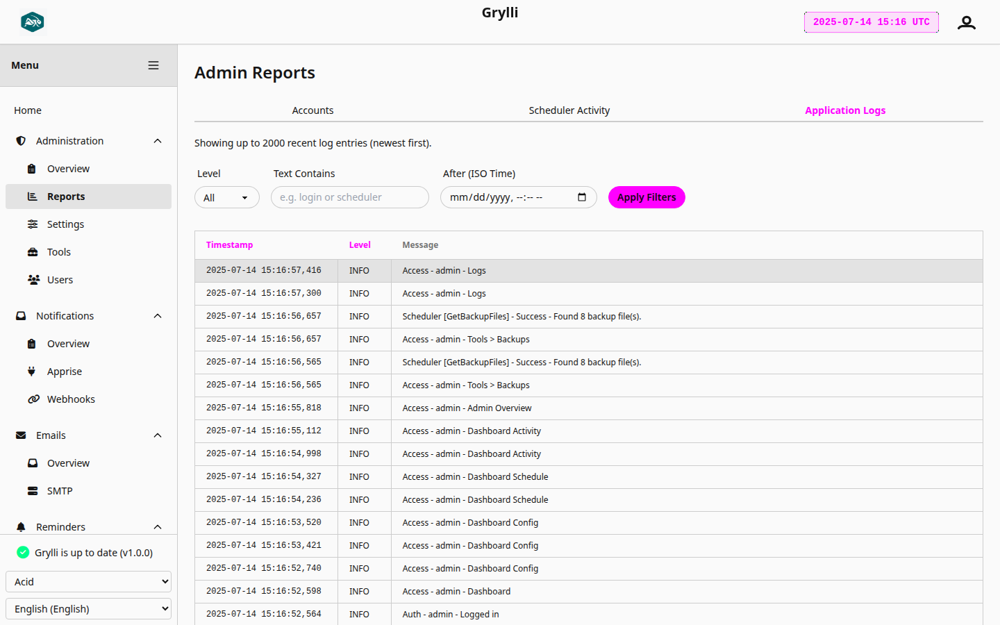
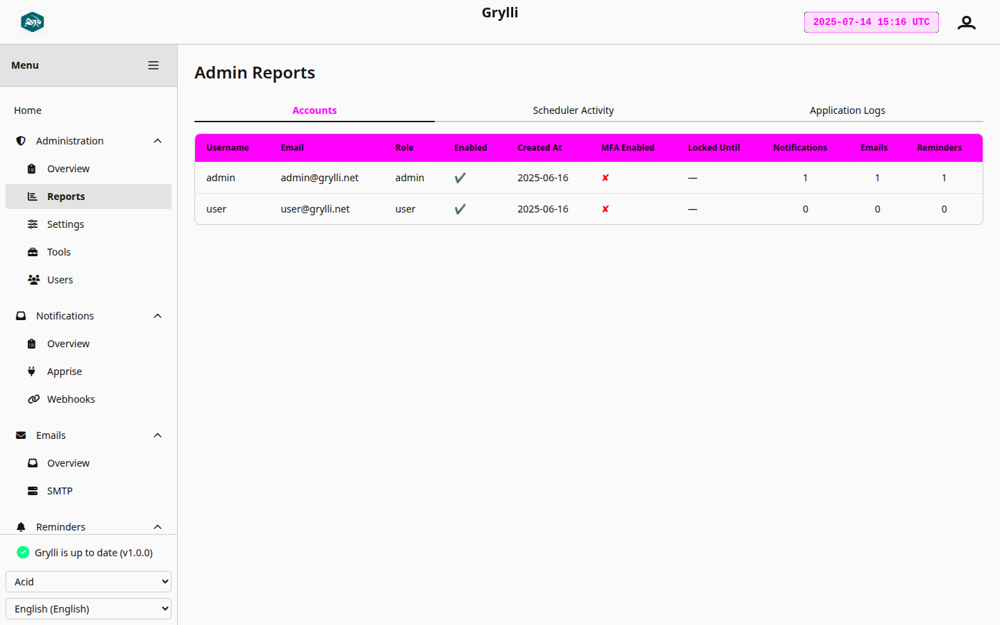
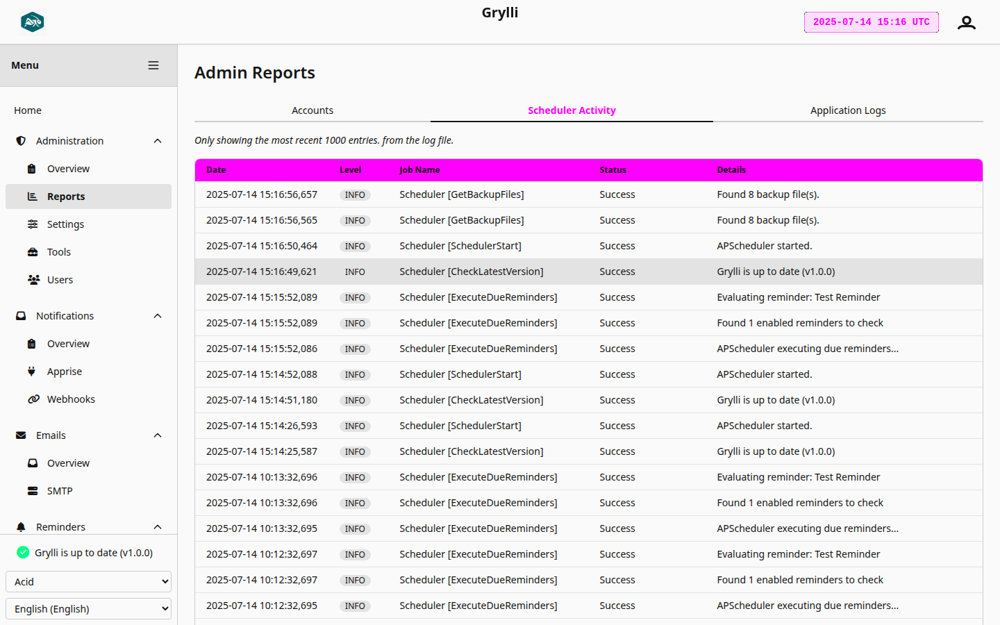
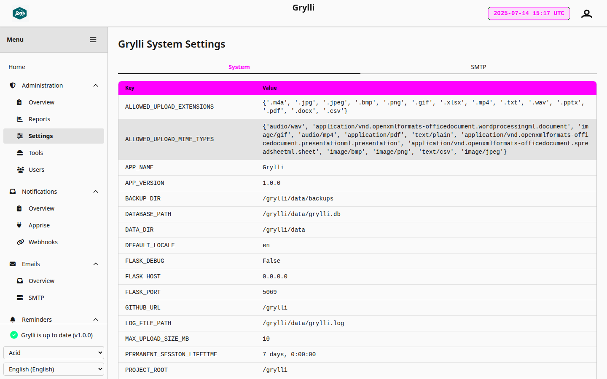
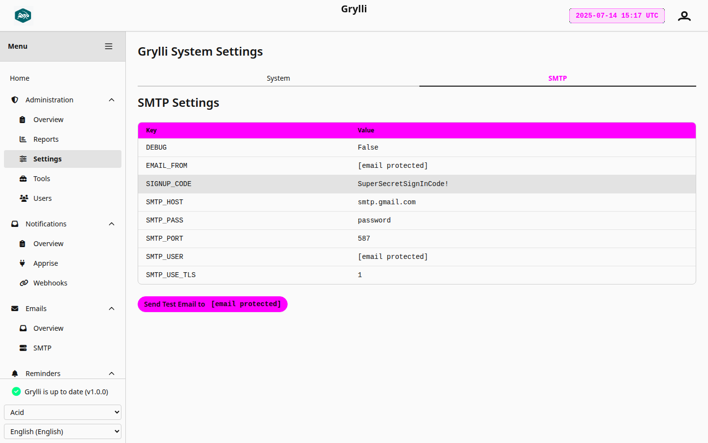
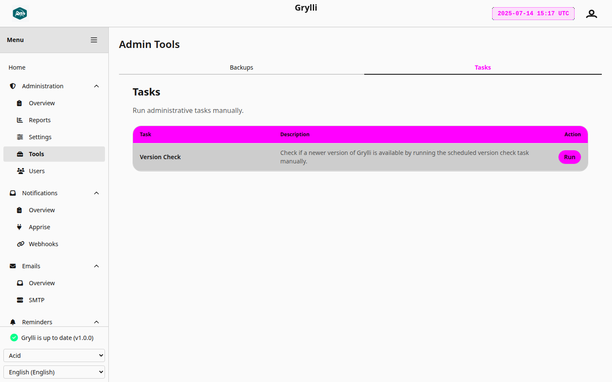

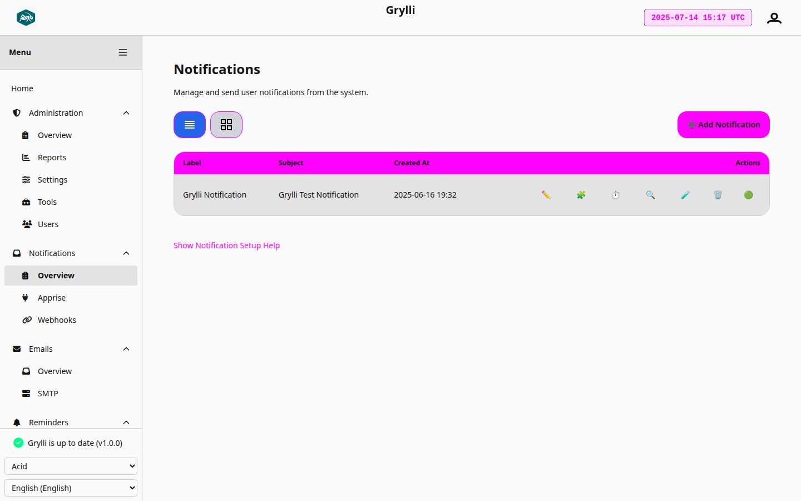
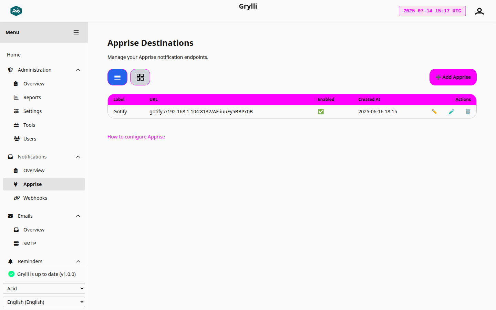

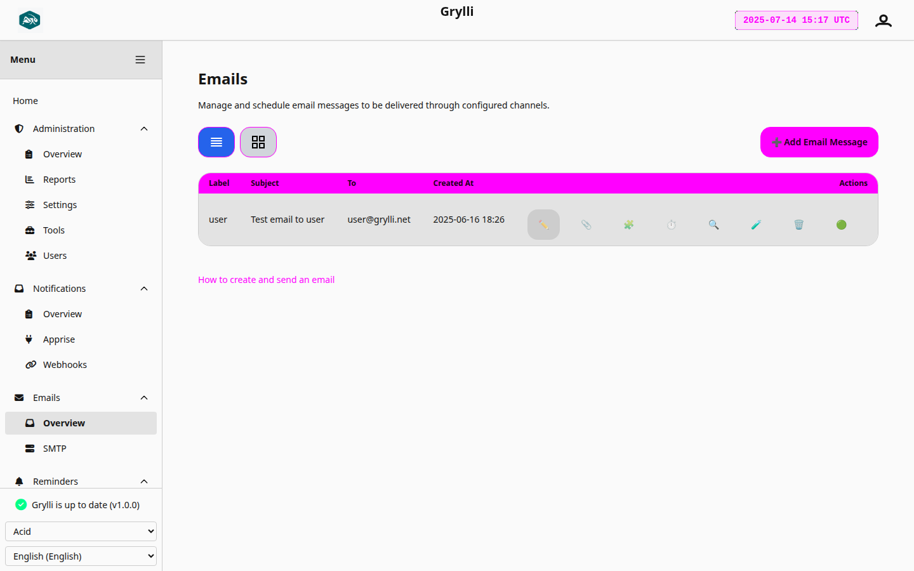

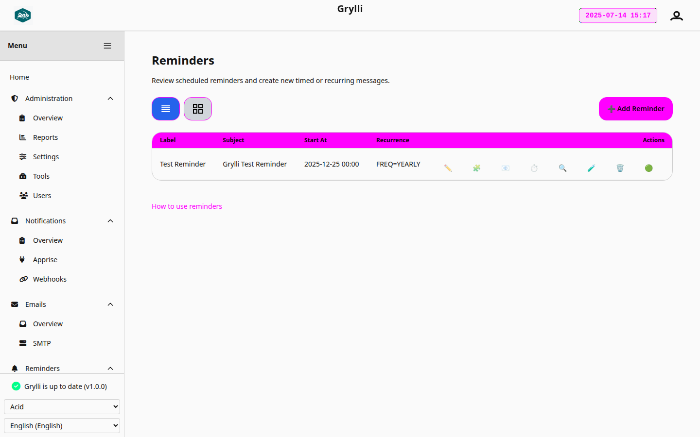

</details>

---

## Docker Compose Configuration
[⬆ Back to Table of Contents](#toc)
[`docker-compose.sample.yml`](./docker-compose.sample.yml)

If you prefer not to use Docker Compose, you can run Grylli with a single command:

<details>
  <summary><strong>Show Docker Run Command</strong></summary>
  
```
docker run -d \
  --name grylli \
  -p 5069:5069 \
  -v $(pwd)/grylli/data:/data \
  -v $(pwd)/grylli/uploads:/uploads \
  -e TZ=America/Chicago \
  -e PUID=1000 \
  -e PGID=1000 \
  -e GRYLLI_DATA_DIR=/data \
  -e DEBUG=False \
  -e FQDN=http://your.domain.com:5069 \
  -e BASE_URL=/grylli \
  -e FLASK_APP_PORT=5069 \
  -e FLASK_APP_KEY=changeme-supersecret-key \
  -e FERRET_KEY=changeme-fernet-key \
  -e SIGNUP_CODE=YourSuperSecretCode123! \
  -e DEFAULT_LANGUAGE=en \
  -e SMTP_HOST=smtp.example.com \
  -e SMTP_PORT=587 \
  -e SMTP_USE_TLS=1 \
  -e EMAIL_FROM=you@example.com \
  -e SMTP_USER=you@example.com \
  -e SMTP_PASS=your_password_or_app_token \
  --restart unless-stopped \
  ghcr.io/samcro1967/grylli
```
</details>

### Environment Variables
[⬆ Back to Table of Contents](#toc)
<details>
  <summary><strong>Show Environment Variables</strong></summary>

| Variable           | Description                                                        | Example/Notes                             |
|--------------------|--------------------------------------------------------------------|-------------------------------------------|
| `TZ`               | Timezone for the container                                         | `America/Chicago`                         |
| `PUID`             | User ID for container process (for volume permissions)             | `1000`                                    |
| `PGID`             | Group ID for container process                                     | `1000`                                    |
| `GRYLLI_DATA_DIR`  | Directory for persistent data inside the container                 | `/data`                                   |
| `DEBUG`            | Enable or disable debug mode                                       | `False` (use `True` for debugging)        |
| `FQDN`             | Public base URL of your Grylli instance                            | `http://your.domain.com:5069`             |
| `BASE_URL`         | Base URL path for Grylli (use `/grylli` or `/`)                    | `/grylli`                                 |
| `FLASK_APP_PORT`   | Port Grylli listens on inside the container                        | `5069`                                    |
| `FLASK_APP_KEY`    | Secret key for Flask session security                              | *(generate a secure random string)*       |
| `FERRET_KEY`       | Encryption key for sensitive data (Fernet, 32-byte base64 string)  | *(generate with Fernet)*                  |
| `SIGNUP_CODE`      | Registration code required for new sign-ups                        | `YourSuperSecretCode123!`                 |
| `DEFAULT_LANGUAGE` | Default language code                                              | `en`                                      |
| `SMTP_HOST`        | SMTP server hostname                                               | `smtp.example.com`                        |
| `SMTP_PORT`        | SMTP server port                                                   | `587` (for TLS), `465` (for SSL)          |
| `SMTP_USE_TLS`     | Use TLS for SMTP connection (1 for yes, 0 for no)                  | `1`                                       |
| `EMAIL_FROM`       | Default sender email address                                       | `you@example.com`                         |
| `SMTP_USER`        | SMTP authentication username                                       | `you@example.com`                         |
| `SMTP_PASS`        | SMTP authentication password or app token                          | `your_password_or_app_token`              |
</details>

> **Note:** See [`docker-compose.sample.yml`](./docker-compose.sample.yml) for instructions on how to generate your own `FLASK_APP_KEY` and `FERRET_KEY`.

---

## Credits & Key Dependencies

### Core Backend
[⬆ Back to Table of Contents](#toc)
- [Flask](https://flask.palletsprojects.com/) — Python web framework
- [Flask-WTF](https://flask-wtf.readthedocs.io/) — Secure web forms with CSRF protection
- [Flask-Login](https://flask-login.readthedocs.io/) — User session and authentication management
- [Flask-Migrate](https://flask-migrate.readthedocs.io/) — Database migrations powered by Alembic
- [Flask-Babel](https://pythonhosted.org/Flask-Babel/) — Internationalization (i18n) and localization
- [APScheduler](https://apscheduler.readthedocs.io/) — Advanced Python scheduling
- [email-validator](https://email-validator.readthedocs.io/) — Email address validation
- [cryptography](https://cryptography.io/) — Secure encryption for sensitive data at rest
- [PyOTP](https://pypi.org/project/pyotp/) — Time-based one-time passwords for MFA
- [python-dateutil](https://dateutil.readthedocs.io/) — Advanced datetime parsing and timezone handling
- [polib](https://polib.readthedocs.io/) — PO file management for localization workflows
- [GPT-PO Translator](https://github.com/gaborvecsei/gpt-po-translator) — Automated PO file translation with GPT

### Frontend & UI
[⬆ Back to Table of Contents](#toc)
- [Stimulus](https://stimulus.hotwired.dev/) — Lightweight JavaScript framework for CSP-compliant interactivity
- [HTMX](https://htmx.org/) — Dynamic HTML-over-the-wire interactivity without custom JavaScript
- [Tailwind CSS](https://tailwindcss.com/) — Utility-first CSS framework for responsive, accessible UI
- [DaisyUI](https://daisyui.com/) — Plugin for TailwindCSS that provides pre-designed components
- [SVGBackgrounds](https://www.svgbackgrounds.com/set/free-svg-backgrounds-and-patterns/) — Open-source SVG background patterns used in the theme-aware background selector
- [PostCSS](https://postcss.org/) — CSS transformation engine used in Tailwind’s build pipeline
- [Autoprefixer](https://github.com/postcss/autoprefixer) — Adds vendor prefixes to CSS rules automatically

### Integrations & Features
[⬆ Back to Table of Contents](#toc)
- [Apprise](https://github.com/caronc/apprise) — Notification delivery to dozens of services
- [htmx-extensions: safe-nonce](https://github.com/MichaelWest22/htmx-extensions/tree/main/safe-nonce) — HTMX extension for CSP nonce propagation
- [Critical](https://github.com/addyosmani/critical) — Extracts and inlines critical-path CSS for faster first paint
- [Pa11y](https://pa11y.org/) — Automated accessibility testing and validation

### Runtime & Deployment
[⬆ Back to Table of Contents](#toc)
- [gunicorn](https://gunicorn.org/) — Production Python WSGI server
- [Docker](https://www.docker.com/) — Containerized application deployment (distroless)
- [Clean-CSS CLI](https://github.com/jakubpawlowicz/clean-css-cli) — CSS minifier for optimized production output
- [Terser](https://github.com/terser/terser) — JavaScript minifier used in production builds

### Testing, Auditing, & Code Quality
[⬆ Back to Table of Contents](#toc)
- [pytest](https://docs.pytest.org/) — Python test framework
- [pytest-cov](https://pypi.org/project/pytest-cov/) — Coverage reporting plugin for pytest
- [black](https://black.readthedocs.io/) — Opinionated Python code formatter
- [isort](https://pycqa.github.io/isort/) — Python import sorter
- [pylint](https://pylint.pycqa.org/) — Static code analysis for Python
- [djlint](https://www.djlint.com/) — Linter and formatter for Jinja2 templates
- [Lighthouse](https://github.com/GoogleChrome/lighthouse) — Performance, accessibility, and SEO auditing for web apps
- [OWASP ZAP](https://www.zaproxy.org/) — Automated security scanning and penetration testing

> Special thanks to these libraries and their maintainers for powering Grylli.

---

## Recommended Third-Party Services
[⬆ Back to Table of Contents](#toc)
- [webhook (adnanh/webhook)](https://github.com/adnanh/webhook) — Simple webhook server
